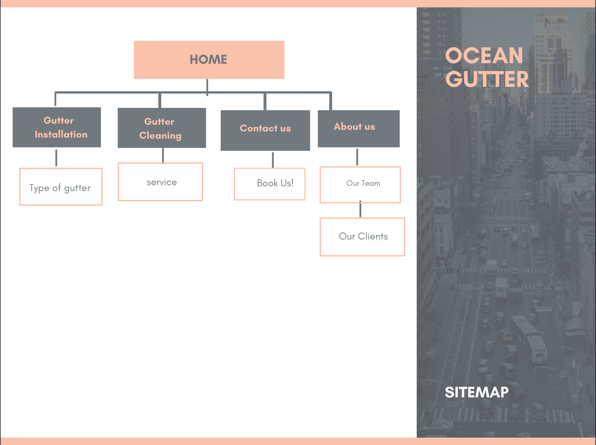
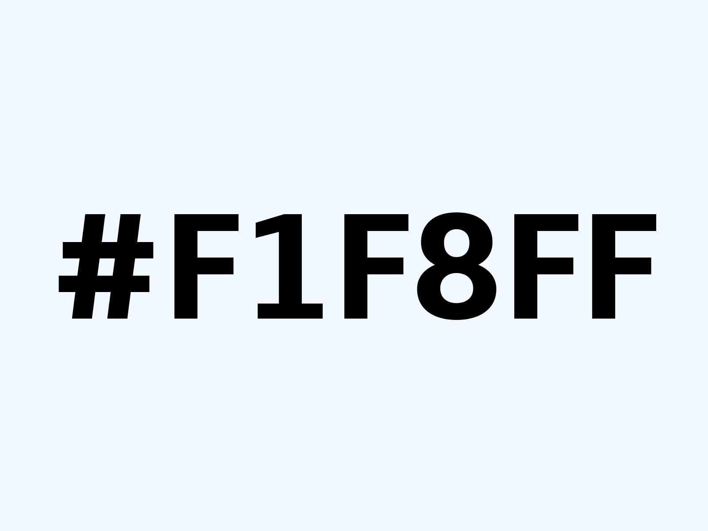

# Site Design - Oceangutter.com

### Wireframes for each page
You can see wireframes for all pages here:
## 

### Site map to illustrate navigation of site
Ocean gutter site map:

### Sample of main site colors 

I will use bg-blue-light for my main background color because of name of site.

#f1f8ff, $bg-blue-light

For text I will use text-gray-dark because it will be clear on background and everybody can read it.Like sample text black on blue-light background. 
## 

For menu button I will use #0B86FF It wil be match with background.
## 

For footer color I will use #BEDFFF it is simillar ti background but a little lighter.
## 

For advertising colors I will use #F26d21 which is contrast color for blue and it can catch users eyes quickly.
## 
